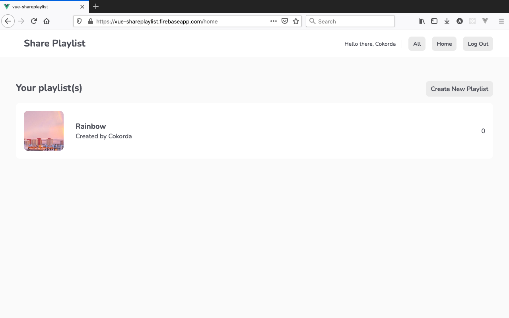

# Share Playlist

> Share your playlist(s) with everyone around the world!

## Table of contents

- [General info](#general-info)
- [Screenshots](#screenshots)
- [Setup](#setup)
- [Features](#features)
- [Inspiration](#inspiration)
- [License](#license)

## General info

Share Playlist is a simple web application where user can sign up, create a playlist of song(s),
and share the playlist to other users.

The user first sign up, then will be redirected to their own homepage. There they can make a new playlist,
upload playlist cover image, and finally add songs to that playlist.

All of users' playlists can be viewed in 'All' page, where user's own playlists can be viewed in 'Home' page.
Users also can delete the songs inside the playlist and the playlist itself.

It is built using vue.js framework as the front-end and
firebase services as back-end.

[Here](https://vue-shareplaylist.firebaseapp.com/) is the link to the deployed web app.

## Screenshots





## Setup

1. Clone this repo
2. Install dependencies `$ npm install`
3. Make a new project in [Firebase](https://console.firebase.google.com/)
4. Register app in Firebase
5. Copy the config snippet, make a new `firebase` folder inside `src` folder. Inside `firebase` folder, make a new `config.js` file and include your copied config snippet.

```
  import firebase from "firebase/app";
  import "firebase/firestore";
  import "firebase/auth";
  import "firebase/storage";

  // paste your config snippet below to replace example
  const firebaseConfig = {
    apiKey: "example",
    authDomain: "example",
    projectId: "example",
    storageBucket: "example",
    messagingSenderId: "example",
    appId: "example",
  };

  // init firebase
  firebase.initializeApp(firebaseConfig);

  // init firebase services
  const projectAuth = firebase.auth();
  const projectFirestore = firebase.firestore();
  const projectStorage = firebase.storage();

  // firestore timestamp
  const timestamp = firebase.firestore.FieldValue.serverTimestamp;

  export { projectAuth, projectFirestore, projectStorage, timestamp };
```

6. Enable Email/Password Sign-in Method under Authentication menu
7. Create Firestore database under Firestore menu
8. Install firebase-tools `$ npm install -g firebase-tools`
9. Login to your firebase account `$ firebase login`
10. Initialize firebase `$ firebase init`. Type `dist` as your public folder
11. Build the app `$ npm run build`
12. Deploy the app `$ firebase deploy`

## Features

To-do list:

- Adding edit playlist's description
- Adding edit songs

## Inspiration

Project is based on Vue project by [@iamshaunjp](https://github.com/iamshaunjp)

## License

MIT
